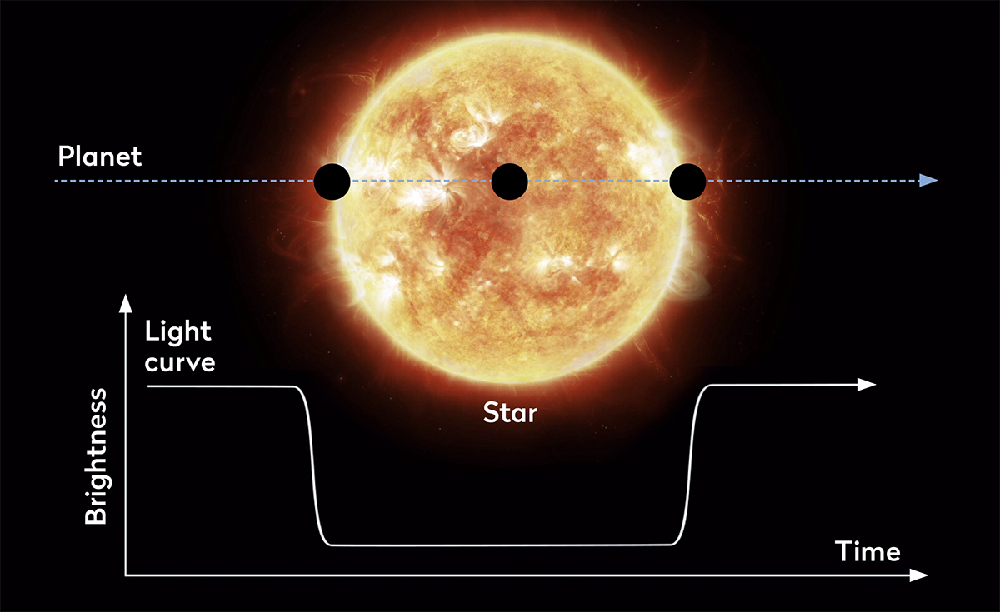

# ExoDec

ExoDec is a Deep Learning-based project designed to detect exoplanets using data from the Transiting Exoplanet Survey Satellite (TESS). The system analyzes light curves (brightness over time) of stars to identify potential transit signals caused by planets passing in front of them.

The project relies on the **Transit Photometry Method**.

**The Transit Method**: When a planet passes in front of its host star (from our perspective), it blocks a tiny fraction of the star's light, causing a periodic dip in brightness.
**Light Curves**: A graph of brightness vs. time. A planet candidate typically shows a U-shaped or V-shaped dip that repeats at a regular interval (the planet's orbital period).
**False Positives**: Not all dips are planets. They can be caused by:
       **Eclipsing Binaries (EBs)**: Two stars orbiting each other.
       **Instrumental Flux**: Noise from the telescope.
       **Stellar Variability**: Spots or flares on the star.

# 3. Implementation Details

### Data Pipeline
1.  **Input Data**: The system uses TESS Light Curves (`.fits` files) sourced via the `lightkurve` library.
2.  **Preprocessing**:
    *   **Stitching**: Combines light curves from different sectors.
    *   **Folding**: The light curve is "folded" over the detected period so all transit events align on top of each other.
    *   **Multi-View Generation**: To help the model distinguish real planets from false positives (like EBs), multiple "views" of the folded light curve are generated:
        *   **Global View**: The entire orbital phase (binned to 201 points) to see the full context.
        *   **Local View**: A zoomed-in view of the transit event itself (binned to 81 points) to analyze the shape of the dip.
        *   **Odd/Even View (Secondary View)**: Folds the light curve to check for secondary eclipses (a signature of binary stars) by looking at phase 0.5.
    *   **TFRecords**: The processed views are saved as TensorFlow Records (`.tfRecords`) for highly efficient training.

### Model Architecture
The model is a **Multi-Input Convolutional Neural Network (CNN)** built with TensorFlow/Keras.

*   **Inputs**: The model accepts 4 simultaneous inputs: `local`, `global`, `odd_even`, and `shifted` views.
*   **Feature Extraction**: Each input passes through its own branch of **1D Convolutional Layers (`Conv1D`)** followed by **Max Pooling**.
*   **Fusion**: The features from all branches are **concatenated** into a single vector.
*   **Classification**: Fully connected (`Dense`) layers process the combined features, ending in a single output neuron (`sigmoid` activation) that predicts the probability of the target being a planet candidate ("PC").
